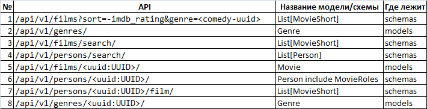

# Проектная работа 4 спринта

11 команда:
  - Дмитрий Гусев @SilentLeaf89

Ссылка на репозиторий:
https://github.com/SilentLeaf89/Async_API_sprint_1

Модели и схемы, используемые в API, приведены на рисунке ниже.

Инструкция по запуску:
  - запустите docker compose в Async_API_sprint_1
    (переменные окружения отсутствуют)
  - после запуска  guvicorn используйте хост и порт, полученный
  из лога, например "[INFO] Listening at: http://172.29.0.4:8000"
  - перейдите по адресу swagger-а: http://<хост>:<порт>/api/openapi
  - протестируйте доступное API и логгирование.
